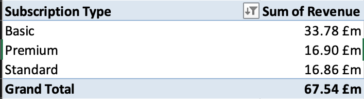
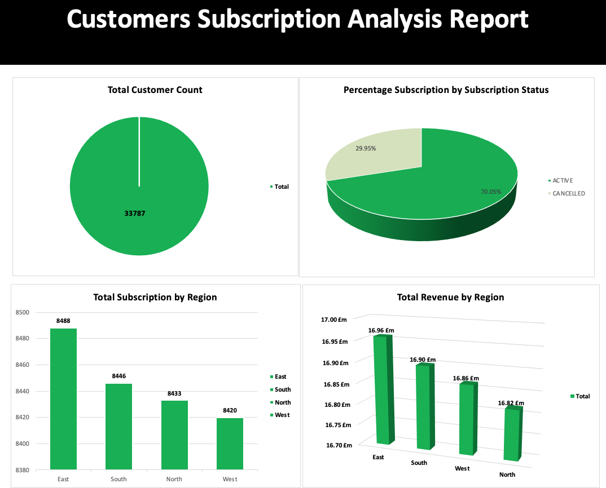
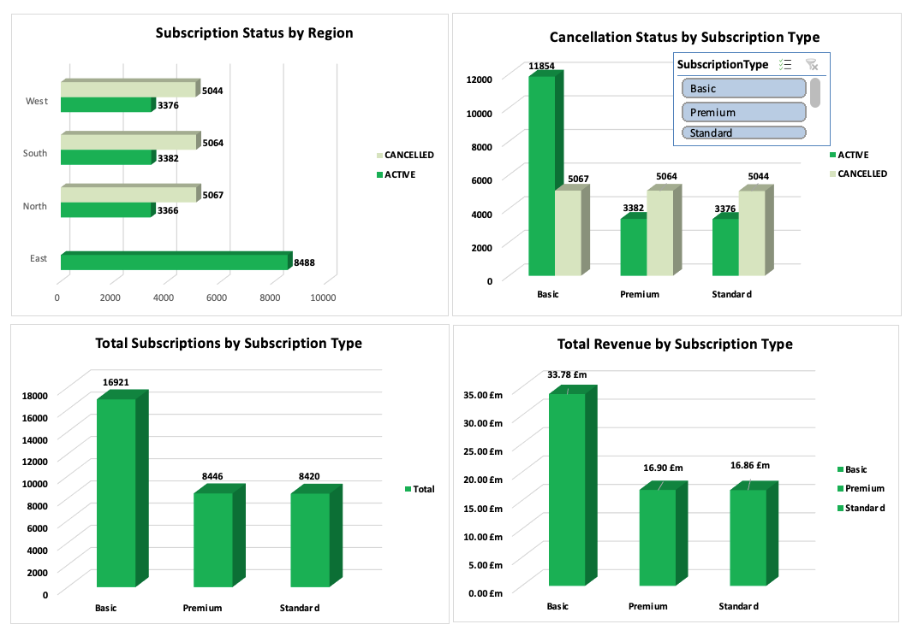

# Customer_Data
## Project Title: Premium Consultancy Customer Subscription Analysis

### Introduction
This is a project where I used both Excel and SQL to analyze customer subscription data, revealing valuable insights into revenue distribution, subscription trends, and regional performance. The analysis provides recommendations to enhance customer retention and help the orgnization make data driven decusions.

**_Disclaimer_**: _All datasets and reports do not represent any company, institution or country but a dummy dataset to demonstrate the cabability of Microsoft  Excel._

### Problem Statement
- What is the revenue distribution across different subscription types?
- What is the revenue distribution across differnt regions?
- What is the percentage of Cancelled subscription compare to the active subscriptions?
- Which subscription type has the highest cancellation rate?
- Which region has the highest subscription cancellation?
- Which region has the highest number of active subscriptions?
- Which subscription type has the highest number of active subscriptions?
- Any other relevant insights

### Excel & SQL Concepts applied
- Excel functions; IF, IFS, TRIM, PROPER
```excel
=IF(G2 = "FALSE", "CANCELLED", "ACTIVE")
```
- Filters
- Slicers
- Pivot tables



``` SQL
SELECT SubscriptionType, sum (Revenue) as total_revenue
FROM Lita_customer_3
GROUP BY  SubscriptionType
ORDER BY  SubscriptionType ASC;

SELECT 
 Region, SubscriptionType, 
    COUNT(CASE WHEN Cancelled = 'TRUE' THEN 1 END) AS Num_of_inactive,
    COUNT(CASE WHEN Cancelled = 'FALSE' THEN 1 END) AS Num_of_active
FROM 
    Lita_customer_3
GROUP BY 
    SubscriptionType;
```

### Data Source
The data was obtained from an open-source data site as a CSV file, after which it was cleaned, analysed, and visualized with Microsoft Excel and SQL.

### Data Transformation and cleaning
To clean the data, duplicates and blanks were removed from from the table using the " Remove duplicate" and "filter" button in excel.
Trim funtion was used to remove excess spaces
Proper function was used to standardize the text

### Data Analysis and Visualization
The report comprises;
- Total Revenue by Region
- Total Revenue by Subscription type
- Total Subscriptios by Subscription Status (Active/ Cancelled)
- Cancellation Status by Subscription Type
- Subscription status by Region
- Percentage Subscription by Subscription Status
- Total Subscriptions by Subscription type





### From the dashboard we could discover the following insights;

- Basic subscriptions account for approximately 50% of the total revenue, with Premium and Standard subscriptions each contributing around 25%.
- The East region generates the highest revenue, contributing roughly 26% of the total, while the North region has the lowest revenue, accounting for about 24%.
- Out of the total subscriptions, 70% are active, and 30% are canceled, indicating a strong retention rate.
- Basic subscriptions lead in active users, making up around 51% of the total subscriptions, while Premium and Standard each represent approximately 25%.
- The East region has the highest number of active subscriptions, accounting for 26% of all subscriptions, while the West region has the lowest at around 24%.
- Basic subscriptions also have the highest cancellation rate, with 30% of all cancellations occurring in this category, followed by Premium and Standard with similar rates.
- Active subscriptions comprise 70% of the total, showing robust customer retention across subscription types.

### Conclusion
The data revealed that the Basic subscriptions drive 50% of revenue and have strong engagement, with 70% of all subscriptions active. The East region is the top market for both revenue and subscriptions. However, Basic subscriptions also face the highest cancellations, indicating an area for improvement. Overall, retention is high, with opportunities to boost engagement in the Basic tier. 

### Reccommendation
The focus should be to implement strategies to reduce cancellations in the Basic subscription tier to maximize revenue from this high-engagement group.


